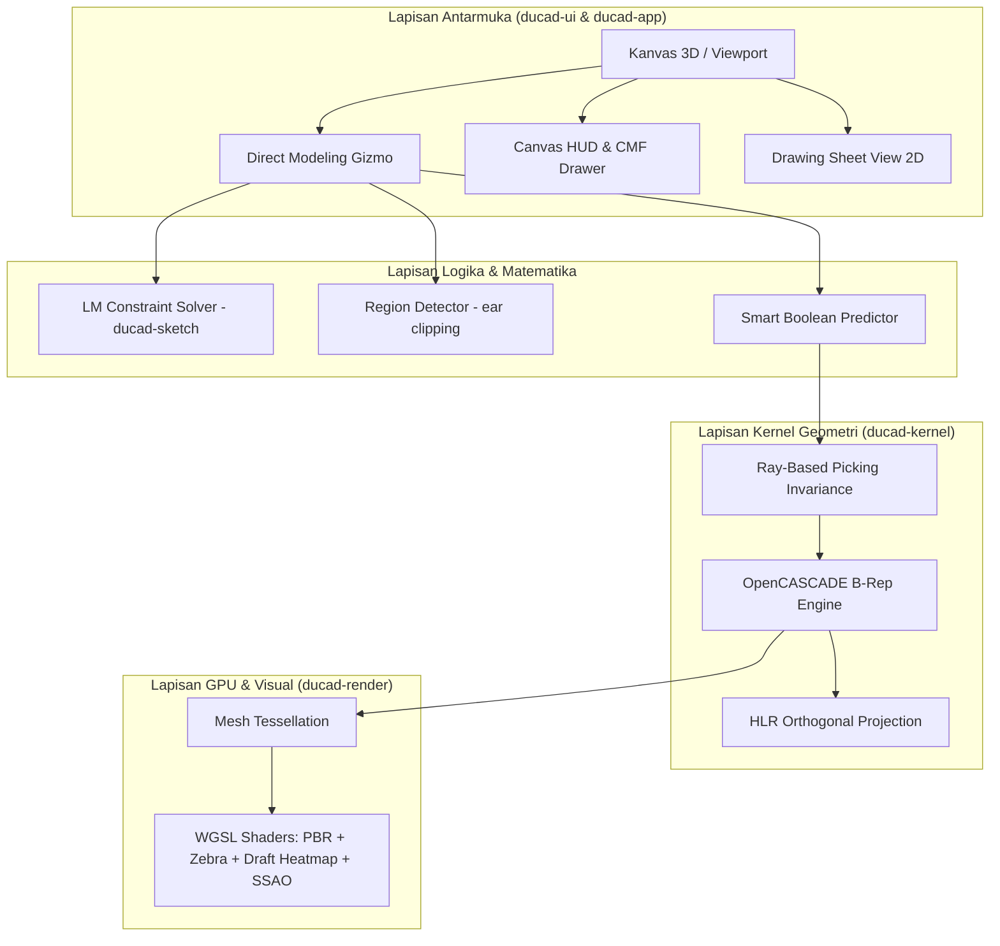
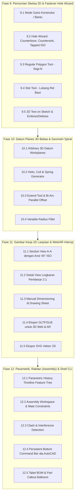

# Analisis Komparatif Mendalam: AutoCAD vs Shapr3D vs DuCAD
## Studi Arsitektur Geometri, Solver, Pipeline GPU, Inventaris Fitur, dan Rencana Fase Pengembangan

Dokumen ini menyajikan analisis komparatif teknis tingkat dalam (*deep-dive comparative analysis*) antara **AutoCAD** (Autodesk), **Shapr3D** (Siemens Parasolid), dan **DuCAD** (OpenCASCADE + Rust). Analisis ini disusun berdasarkan audit menyeluruh terhadap arsitektur kode sumber, fungsi matematika, algoritma topologi B-Rep, pipeline shader GPU, sistem manipulasi langsung (*direct modeling*), serta modul I/O yang telah diimplementasikan di dalam workspace DuCAD.

---

## 1. Matriks Komparasi Teknis Komprehensif

| Kategori & Dimensi Teknis | AutoCAD (Autodesk) | Shapr3D (Siemens Parasolid) | DuCAD (OpenCASCADE + Rust) | Status & Implikasi Kompetitif |
| :--- | :--- | :--- | :--- | :--- |
| **Kernel Geometri Solid (B-Rep Engine)** | **Autodesk ShapeManager (ASM)** (turunan ACIS C++). History CSG legacy + direct editing terbatas. | **Siemens Parasolid**. Proprietary C++. Standar emas industri dirgantara/otomotif untuk solid modeling presisi. | **OpenCASCADE Technology (OCCT)** via FFI wrapper Rust [`ducad-kernel`](file:///Users/jayuda/Documents/PROJECT/DUCAD/crates/ducad-kernel). B-Rep state diisolasi penuh dalam [`KernelShape`](file:///Users/jayuda/Documents/PROJECT/DUCAD/crates/ducad-kernel/src/shape.rs) dengan perlindungan thread-safe [`lock_kernel()`](file:///Users/jayuda/Documents/PROJECT/DUCAD/crates/ducad-kernel/src/lib.rs). | **Setara Shapr3D**: OCCT dan Parasolid adalah kernel B-Rep sejati (bukan mesh polygon seperti Blender). DuCAD memiliki kapabilitas STEP/fillet/boolean industri tanpa biaya lisensi jutaan dolar. |
| **Solver Kendala Sketsa 2D (Constraint Solver)** | **Autodesk 2D Parametric Engine**. Kendala geometris/dimensional berbasis Ribbon AutoCAD. | **Siemens D-Cubed 2D DCM**. Solver komersial kelas industri. | **Custom Levenberg-Marquardt Solver** ([`ducad_sketch::constraint::solve`](file:///Users/jayuda/Documents/PROJECT/DUCAD/crates/ducad-sketch/src/constraint/solver.rs)). Solver mandiri berbasis kuadrat terkecil non-linier dengan redaman Levenberg murni ($\lambda I$). Mendukung 12 jenis kendala (Coincident, Fixed, Horizontal, Vertical, Parallel, Perpendicular, EqualLength, EqualRadius, Distance, Radius, Angle, Tangent, Symmetric). | **Unggul & Independen**: DuCAD tidak bergantung pada lisensi D-Cubed. Redaman Levenberg murni mencegah matriks singular pada sistem *under-constrained*. |
| **Kurva Organik 2D & Spline** | NURBS Spline (Fit Points & Control Vertices $C^2/C^3$). | NURBS B-Spline dengan kontrol titik fit interaktif. | **Catmull-Rom $C^1$ Spline** ([`Entity::Spline`](file:///Users/jayuda/Documents/PROJECT/DUCAD/crates/ducad-sketch/src/entity.rs)) dengan konversi analitik **Bi-Arc** ([`convert_spline_to_smooth_segments`](file:///Users/jayuda/Documents/PROJECT/DUCAD/crates/ducad-kernel/src/profile.rs)) ke wire OCCT untuk menjamin permukaan 3D bebas lipatan (*crease-free*). | **Optimal untuk Desain Industri**: Menghasilkan profil lengkung ergonomis untuk produk konsumen (mouse, botol, handle) yang dapat di-extrude dan di-sweep dengan mulus. |
| **Deteksi Profil Tertutup (Closed Loops)** | Perintah `REGION`, `BOUNDARY`, atau Hatch Boundary detection manual. | **Live Planar Closed Loop Detection**. Region diarsir otomatis saat loop tertutup; siap di-tap & di-pull. | **Live Closed Region Engine** ([`ducad_sketch::region::ClosedRegion`](file:///Users/jayuda/Documents/PROJECT/DUCAD/crates/ducad-sketch/src/region.rs)). Deteksi loop tertutup otomatis via graph traversal, point-in-polygon ray casting, triangulasi *ear-clipping* instan, dan kalkulasi titik berat (*centroid*). | **Setara Shapr3D**: Memberikan pengalaman pengguna (*UX*) modern di mana pengguna tidak perlu repot menggabungkan polyline secara manual. |
| **Fillet & Chamfer Sketsa 2D** | Perintah `FILLET` / `CHAMFER` berbasis klik 2 garis terpisah. | Drag interaktif langsung pada titik sudut (vertex) sketsa. | **Algoritma Fillet 2D Tangensial & Corner Gizmo** ([`compute_fillet_2d`](file:///Users/jayuda/Documents/PROJECT/DUCAD/crates/ducad-sketch/src/ops.rs), [`find_all_corners`](file:///Users/jayuda/Documents/PROJECT/DUCAD/crates/ducad-sketch/src/ops.rs)). Deteksi otomatis sudut pertemuan dan handle gizmo busur interaktif di kanvas. | **Unggul dari AutoCAD**: Membulatkan sudut profil sketsa secara langsung sebelum di-extrude ke 3D. |
| **Direct Modeling & Smart Extrude/Cut** | Perintah `PRESSPULL` atau `EXTRUDE` terpisah dari perintah boolean `SUBTRACT`. | **Adaptive Push/Pull**. Menarik profil menjauh = New Body / Join; mendorong menembus bodi = Auto Cut. | **Smart Boolean Cut Detection** ([`update_gizmo_boolean_detection`](file:///Users/jayuda/Documents/PROJECT/DUCAD/crates/ducad-app/src/overlay/gizmo.rs)). Deteksi *bounding box overlap* dan uji irisan B-Rep ([`ducad_kernel::intersect`](file:///Users/jayuda/Documents/PROJECT/DUCAD/crates/ducad-kernel/src/csg.rs)) secara real-time saat gizmo ditarik untuk otomatis beralih ke mode potong (*subtract*). | **Setara Shapr3D**: Mengeliminasi friksi pemilihan perintah boolean secara manual. |
| **Picking 3D & Invarian Topologi** | Pemilihan objek 3D klasik berbasis nama sub-entitas AutoCAD. | Direct face/edge hit-testing terintegrasi pada kernel Parasolid. | **Ray-Based Picking Invariance** ([`PickRay`](file:///Users/jayuda/Documents/PROJECT/DUCAD/crates/ducad-kernel/src/picking/ray.rs), [`resolve_edge_along_ray`](file:///Users/jayuda/Documents/PROJECT/DUCAD/crates/ducad-kernel/src/picking/edge.rs), [`resolve_face_along_ray`](file:///Users/jayuda/Documents/PROJECT/DUCAD/crates/ducad-kernel/src/picking/face.rs)). Menyimpan seleksi sebagai sinar 3D di ruang dunia, kebal terhadap pergeseran indeks B-Rep pasca modifikasi dan Undo/Redo. | **Solusi Inovatif**: Memecahkan masalah klasik *topological naming* pada kernel C++ tanpa overhead data yang rumit. |
| **Fillet, Chamfer & Shell 3D Lanjutan** | `FILLETEDGE`, `CHAMFEREDGE`, `SHELL` solid body via property panel. | Pemilihan face/edge langsung di kanvas dengan panah drag radius adaptif. | **Selective B-Rep Modifiers** ([`fillet_edges`](file:///Users/jayuda/Documents/PROJECT/DUCAD/crates/ducad-kernel/src/modify.rs), [`fillet_vertex`](file:///Users/jayuda/Documents/PROJECT/DUCAD/crates/ducad-kernel/src/modify.rs), [`chamfer_edges`](file:///Users/jayuda/Documents/PROJECT/DUCAD/crates/ducad-kernel/src/modify.rs), [`shell_hollow_faces`](file:///Users/jayuda/Documents/PROJECT/DUCAD/crates/ducad-kernel/src/modify.rs), [`shell_variable_thickness`](file:///Users/jayuda/Documents/PROJECT/DUCAD/crates/ducad-kernel/src/modify.rs)). | **Sangat Kuat**: Mendukung fillet per-edge, fillet sudut bola (vertex fillet), dan penipisan dinding wadah multi-face. |
| **Fitur Desain Manufaktur Industri (DFM)** | Mengandalkan software eksternal (Autodesk Inventor / Moldflow). | Draft Angle tool, Split Body / Split Face, Shell. | **Native Industrial DFM Tools** ([`draft_angle`](file:///Users/jayuda/Documents/PROJECT/DUCAD/crates/ducad-kernel/src/modify.rs), [`split_body_with_tool`](file:///Users/jayuda/Documents/PROJECT/DUCAD/crates/ducad-kernel/src/modify.rs), [`split_face`](file:///Users/jayuda/Documents/PROJECT/DUCAD/crates/ducad-kernel/src/modify.rs), [`create_rib_solid`](file:///Users/jayuda/Documents/PROJECT/DUCAD/crates/ducad-kernel/src/modify.rs)). | **Krusial untuk Casing Plastik & Die-Cast**: Membagi part atas-bawah (*parting line*), memberi kemiringan lepas cetakan, dan menambahkan rusuk penguat (*ribs*). |
| **Inspeksi Kualitas Permukaan (Surface Quality)** | Zebra Analysis & Curvature Display (hanya di AutoCAD Mechanical/Inventor). | Zebra Stripes Reflection Shader, Curvature Map, Draft Angle Analysis. | **GPU WGSL Custom Shaders** ([`shader.wgsl`](file:///Users/jayuda/Documents/PROJECT/DUCAD/crates/ducad-render/src/shader.wgsl)): • **Zebra Reflection Shader** (Validasi kontinuitas tangensial $G^1$ dan kurvatur $G^2$). • **Draft Angle Heatmap Inspector** (Pewarnaan sudut lepas cetakan: Hijau $\ge \theta_{\text{safe}}$, Kuning kritis, Merah *undercut*). | **Setara Shapr3D / Fusion 360**: Analisis visual instan di GPU tanpa membebani thread pemodelan utama. |
| **Material & Rendering Visual (CMF)** | AutoCAD Render engine (CPU raytracing/Arnold terpisah). | Real-time PBR visualizer (Metal, Rough Plastic, Glass, Car Paint). | **Real-Time PBR & Studio Lighting Pipeline** ([`cmf_drawer.rs`](file:///Users/jayuda/Documents/PROJECT/DUCAD/crates/ducad-ui/src/cmf_drawer.rs), [`shader.wgsl`](file:///Users/jayuda/Documents/PROJECT/DUCAD/crates/ducad-render/src/shader.wgsl)): 3-Point Studio Lighting (Key, Fill, Rim), Cavity SSAO, Floor Contact Soft Shadow (Gaussian penumbra), dan preset material CMF industri. | **Kelebihan Estetika**: Memberikan pratinjau produk mewah secara instan kepada klien atau tim marketing sebelum produksi. |
| **Gambar Kerja Teknik 2D (Engineering Drawings)** | **Standar Industri Terkuat**: Layout tabs, Viewports, Paper Space, Block, GD&T, DWG/DXF native. | Modul 2D Drawings (A4-A0, auto projection, auto dimensions, export PDF/DWG). | **Modul Gambar Kerja Terintegrasi** ([`hlr.rs`](file:///Users/jayuda/Documents/PROJECT/DUCAD/crates/ducad-kernel/src/hlr.rs), [`drawing.rs`](file:///Users/jayuda/Documents/PROJECT/DUCAD/crates/ducad-io/src/drawing.rs), [`pdf.rs`](file:///Users/jayuda/Documents/PROJECT/DUCAD/crates/ducad-io/src/pdf.rs)): Ekstraksi Hidden Line Removal (HLR) 4 tampak, garis sumbu simetri, etiket ISO 7200, dan **Generator PDF Vektor Resolusi Tinggi Native**. | **Disruptif**: Fitur gambar teknik 2D lengkap tanpa biaya langganan tambahan ($38/bulan di Shapr3D). |
| **Penyimpanan File & Privasi Data** | Format proprietary `.dwg` / Autodesk Construction Cloud. | Proprietary format `.shapr` dengan sinkronisasi Cloud Shapr3D. | **Format Terbuka & 100% Offline**: `.ducad` (JSON envelope + STEP B-Rep), ekspor/impor `.step`, `.dxf`, `.stl`, `.obj`, `.pdf`. | **Keunggulan Privasi**: Tidak ada ketergantungan cloud (*no vendor lock-in*), data aman di penyimpanan lokal pengguna. |
| **Stack Bahasa & Performa Runtime** | C++ monolitik (~40 tahun *codebase*), DirectX/GDI, konsumsi RAM besar (~1.5–3 GB). | Swift + C++ (Parasolid) + Metal pada macOS/iOS; C++ pada Windows. | **100% Modern Rust** (8 crates modular) + `wgpu` (Vulkan/Metal/DX12) + `egui`. Ringan, memory-safe, RAM < 150 MB, startup < 1 detik. | **Super Cepat & Tangguh**: Keamanan memori terjamin tanpa *garbage collection*, siap dijalankan dari laptop hemat daya hingga workstation. |

---

## 2. Bedah Detail Arsitektur & Fungsi Internal DuCAD

Melihat lebih dalam ke baris kode implementasi yang telah dibangun di dalam workspace DuCAD:

---

### A. Arsitektur Kernel Geometri B-Rep (`ducad-kernel`)
DuCAD mengadopsi kernel **OpenCASCADE Technology (OCCT)** yang merupakan salah satu kernel B-Rep open-source paling matang di dunia industri.
* **Isolasi Mutlak C++/Rust**: Crate `ducad-kernel` membungkus seluruh tipe pointer mentah OCCT di balik [`KernelShape`](file:///Users/jayuda/Documents/PROJECT/DUCAD/crates/ducad-kernel/src/shape.rs). Crate lain (`ducad-app`, `ducad-ui`) tidak pernah menyentuh tipe FFI langsung.
* **Thread Serialization (`KERNEL_LOCK`)**: Karena transfer STEP pada OCCT memiliki *global state* non-thread-safe pada level C++, DuCAD menerapkan penguncian mutex global [`lock_kernel()`](file:///Users/jayuda/Documents/PROJECT/DUCAD/crates/ducad-kernel/src/lib.rs) di setiap operasi publik kernel. Ini menjamin kestabilan mutlak tanpa resiko *concurrency race condition*.
* **Solusi Invarian Topologi (Ray-Based Picking)**:
  Dalam pemodelan langsung (*direct modeling*), mengidentifikasi edge/face via nomor indeks array sangat rentan pecah setelah operasi Boolean atau Fillet. DuCAD memecahkan ini secara matematis melalui [`PickRay`](file:///Users/jayuda/Documents/PROJECT/DUCAD/crates/ducad-kernel/src/picking/ray.rs):
  $$\text{Ray}(t) = \mathbf{O} + t \cdot \mathbf{D}$$
  Saat perintah fillet edge atau hollow face dieksekusi pada solid hasil `deep_clone`, sinar (*ray*) ditembakkan ulang ke geometri baru untuk meresolusi topologi yang bersesuaian, mempertahankan identitas seleksi pengguna secara sempurna.

---

### B. Solver Kendala Sketsa 2D (`ducad-sketch`)
Berbeda dengan aplikasi CAD sederhana yang hanya menempatkan garis statis, DuCAD memiliki solver kendala non-linier mandiri di [`ducad_sketch::constraint::solver`](file:///Users/jayuda/Documents/PROJECT/DUCAD/crates/ducad-sketch/src/constraint/solver.rs):
* **Formulasi Vektor Parameter**: Entitas sketsa dipetakan ke dalam vektor derajat kebebasan (*degrees of freedom* / DOF) $X \in \mathbb{R}^n$ (Garis: 4 DOF, Lingkaran: 3 DOF, Arc: 5 DOF, Elips: 4 DOF).
* **Vektor Residual Kendala**: Setiap kendala geometris (sejajar, tegak lurus, tangen, jarak, sudut, konsentris) dirumuskan menjadi fungsi residual $f_i(X) = 0$.
* **Algoritma Levenberg-Marquardt Damped Solve**:
  $$(J^T J + \lambda I) \, \Delta X = -J^T f(X)$$
  Dengan menggunakan **Levenberg Damping ($\lambda I$)**, DuCAD menghindari singularitas matriks yang umum terjadi pada solver Marquardt standar ketika terdapat parameter bebas yang belum terikat kendala.
* **Dry-Run Validation**: Solver dieksekusi pada salinan sketsa sementara (*dry-run*). Perubahan hanya diterapkan ke dokumen jika residual $\lVert f(X) \rVert < \epsilon$ terpenuhi, mencegah model sketsa rusak akibat kendala yang bertolak belakang (*over-constrained*).

---

### C. Mesin Deteksi Region Sketsa & Smart Boolean Cut (`ducad-sketch` & `ducad-app`)
* **Planar Region Graph Traversal**: [`ClosedRegion`](file:///Users/jayuda/Documents/PROJECT/DUCAD/crates/ducad-sketch/src/region.rs) secara otomatis menelusuri sambungan ujung-ke-ujung (*endpoint matching*) dari kumpulan garis, busur, dan spline untuk mendeteksi loop tertutup.
* **Ear-Clipping Triangulation**: Menghasilkan mesh segitiga 2D instan untuk menampilkan efek arsiran/highlight biru transparan di kanvas saat kursor melayang di atas profil tertutup.
* **Smart Boolean Extrude**: Saat gizmo panah normal ditarik melewati badan solid lain, fungsi [`update_gizmo_boolean_detection`](file:///Users/jayuda/Documents/PROJECT/DUCAD/crates/ducad-app/src/overlay/gizmo.rs) secara live menguji tumpang tindih AABB (*Axis-Aligned Bounding Box*) dan melakukan evaluasi interseksi B-Rep nyata [`ducad_kernel::intersect`](file:///Users/jayuda/Documents/PROJECT/DUCAD/crates/ducad-kernel/src/csg.rs). Jika terjadi irisan volume, sistem secara cerdas beralih dari operasi penambahan solid (*Join*) menjadi operasi pemotongan solid (*Cut*).

---

### D. Pipeline GPU WGSL: Inspeksi DFM, Kualitas Kontinuitas, & CMF Visualizer
Pipeline grafis [`shader.wgsl`](file:///Users/jayuda/Documents/PROJECT/DUCAD/crates/ducad-render/src/shader.wgsl) pada `ducad-render` dirancang khusus untuk memenuhi standar industri modern:
1. **Zebra Stripes Reflection Shader**:
   Memproyeksikan pola garis refleksi lingkungan silindris/sferis:
   $$u = \frac{\text{atan2}(r_y, r_x)}{\pi}, \quad v = r_z$$
   $$\text{stripe} = \text{smoothstep}\left(-\epsilon, \epsilon, \sin\left((\cos\alpha \cdot v + \sin\alpha \cdot u) \cdot \text{freq} \cdot \pi\right)\right)$$
   Memungkinkan desainer memvalidasi keluwesan pantulan cahaya pada permukaan kelas A (*Class-A Surface*) untuk memastikan kontinuitas tangen ($G^1$) dan kurvatur ($G^2$).
2. **Draft Angle Heatmap Inspector**:
   Menghitung sudut inklinasi permukaan terhadap arah pembukaan cetakan (*pull direction* $\mathbf{d}_{\text{pull}}$):
   $$\cos(\theta) = \mathbf{n} \cdot \mathbf{d}_{\text{pull}}$$
   - **Hijau**: Sudut aman ($\ge 1.0^\circ$).
   - **Kuning**: Sudut kritis ($0.0^\circ - 1.0^\circ$).
   - **Merah**: *Undercut* (kemiringan terbalik yang menyebabkan part plastik tersangkut di cetakan).
3. **PBR Material & Studio Lighting**:
   - Pencahayaan studio 3-titik (*Key, Fill, Rim Light*).
   - *Screen-Space Cavity & Curvature Ambient Occlusion (SSAO)* untuk mempertegas celah dan sudut part mekanikal.
   - *Floor Contact Soft Shadow* dengan degradasi Gaussian penumbra.

---

### E. Ekstraksi Proyeksi Ortogonal (HLR) & PDF Vektor Native
* **Hidden Line Removal (HLR)**: Modul [`hlr.rs`](file:///Users/jayuda/Documents/PROJECT/DUCAD/crates/ducad-kernel/src/hlr.rs) memproyeksikan geometri solid 3D ke 4 tampak standar (Depan, Atas, Samping Kanan, Isometrik 3D) dengan pemisahan jenis garis sesuai standar ISO (Garis tampak tebal, garis tersembunyi putus-putus, garis sumbu simetri, dan siluet lengkung).
* **Native PDF 1.4 Vector Writer**: Modul [`pdf.rs`](file:///Users/jayuda/Documents/PROJECT/DUCAD/crates/ducad-io/src/pdf.rs) menuliskan struktur objek PDF vektor resolusi tinggi langsung dari memori byte buffer tanpa dependensi C/C++ eksternal. Menghasilkan lembar gambar teknik lengkap dengan bingkai grid zona, etiket kepala gambar ISO 7200, simbol proyeksi Amerika/Eropa, dan garis dimensi akurat.

---

## 3. Rencana Fase Penambahan Fitur Lengkap (Phase 9 – Phase 12 Roadmap)

Berdasarkan kesenjangan fungsional yang telah diidentifikasi, berikut adalah rencana eksekusi modular bertahap (Fase 9 hingga Fase 12) untuk menyempurnakan DuCAD menjadi software CAD kelas industri:

---

### Fase 9: Pemurnian Sketsa 2D & Fastener Hole Wizard
**Tujuan**: Memberikan presisi pembuatan part mekanikal presisi dan pelengkap alur sketsa cepat.

- [ ] **9.1 Mode Garis Konstruksi (*Construction / Reference Line*)**:
  - Penambahan field `is_construction: bool` pada `Entity`.
  - Shader/renderer `ducad-render` menggambar garis putus-putus (*dashed line*) oranye.
  - Modifikasi `ClosedRegion` di `ducad-sketch` agar garis konstruksi diabaikan dari deteksi loop tertutup sehingga tidak ikut di-extrude.
  - Shortcut keyboard `X` untuk mengubah entitas aktif menjadi garis konstruksi.
- [ ] **9.2 Hole Wizard & Standar Baut ISO (*Counterbore / Countersink / Tapped*)**:
  - Integrasi generator fitur lubang di `ducad-kernel` menggunakan operasi Boolean silinder bertingkat dan tirus:
    - *Simple Hole*: Lubang silinder lurus (tembus atau berkedalaman tertentu).
    - *Counterbore Hole*: Lubang bertingkat untuk kepala baut L (*Socket Head Cap Screw*).
    - *Countersink Hole*: Lubang tirus 90° untuk baut kepala rata (*Flat Head Screw*).
    - *Tapped Hole*: Lubang ulir standar metrik (M2, M2.5, M3, M4, M5, M6, M8, M10, M12).
  - Dialog pop-up UI terintegrasi dengan tabel dimensi ISO standar.
- [ ] **9.3 Regular Polygon Tool (Segi-N Beraturan)**:
  - Tool pembuatan poligon $N$-sisi (segi-3, segi-5, segi-6 heksagonal untuk kepala baut/mur, segi-8).
  - Mode penentuan ukuran: *Inscribed* (di dalam lingkaran) atau *Circumscribed* (di luar lingkaran).
- [ ] **9.4 Slot Tool (Lubang Pengait / Rel Baut)**:
  - Pembuatan slot lonjong otomatis dari 2 titik pusat (*Center-to-Center Slot*) atau panjang total (*Overall Slot*) dan diameter lebar.
- [ ] **9.5 2D Text on Sketch & Emboss/Deboss**:
  - Rasterisasi/vektorisasi huruf font TTF/OTF ke kurva 2D sketsa.
  - Mendukung ekstrusi timbul (*Emboss*) dan ukiran tenggelam (*Deboss/Engrave*) pada permukaan bodi 3D.

---

### Fase 10: Datum Reference Planes 3D Bebas & Geometri Spiral
**Tujuan**: Memungkinkan pembuatan geometri miring di sembarang koordinat ruang 3D dan komponen spiral/pegas.

- [ ] **10.1 Arbitrary 3D Datum Workplanes (Bidang Referensi Bebas)**:
  - Perluasan struktur `SketchPlane` dari 3 bidang tetap menjadi bidang dinamis dengan parameter `(origin, u_axis, v_axis, normal)`.
  - Metode pembuatan bidang baru:
    1. *Offset Plane*: Berjarak $d$ mm dari face planar atau plane acuan.
    2. *Angled Plane*: Memutar $\theta^\circ$ terhadap edge linear acuan.
    3. *3-Point Plane*: Membentuk bidang datar yang melalui 3 titik vertex acuan.
  - Pemilih bidang sketsa aktif terintegrasi dengan penyorotan visual transparan di viewport.
- [ ] **10.2 Helix / Coil / Spring Tool (Kurva Spiral 3D)**:
  - Generator kurva parametrik 3D:
    $$x(t) = R \cos(2\pi t), \quad y(t) = R \sin(2\pi t), \quad z(t) = \text{pitch} \cdot t$$
  - Disambungkan ke fungsi `sweep_profile_along_path` untuk menghasilkan pegas kawat (*spring*), ulir botol, dan pisau ulir sekrup (*auger*).
- [ ] **10.3 Extend Tool & Bi-Arc Parallel Offset**:
  - Algoritma `extend_segment` pada `ducad-sketch` yang memperpanjang garis sampai menyentuh batas kurva terdekat.
  - Perluasan fungsi `offset_entity` agar mendukung kurva Ellipse dan Spline menggunakan pendekatan multi-arc tangensial.
- [ ] **10.4 Variable Radius Fillet (Fillet Radius Berubah)**:
  - Integrasi API OpenCASCADE `BRepFilletAPI_MakeFillet` dengan parameter radius variabel di titik awal dan titik akhir ($R_{\text{start}} \ne R_{\text{end}}$).

---

### Fase 11: Gambar Kerja 2D Lanjutan & Web/AR Interoperability
**Tujuan**: Menghasilkan gambar teknik potongan berstandar industri dan format presentasi 3D web/AR.

- [ ] **11.1 Section View A-A (Tampak Potongan Melintang)**:
  - Ekstraksi irisan solid 3D pada bidang potong menggunakan `BRepAlgoAPI_Section`.
  - Generator pola arsiran (*Hatch pattern*) garis miring 45° standar ISO/ANSI pada area potongan solid.
  - Indikator garis potong panah `A ─── A` pada tampak acuan.
- [ ] **11.2 Detail View (Lingkaran Pembesar Skala Detail)**:
  - Pembuatan viewport lingkaran dengan faktor skala pembesar independen (2:1, 5:1, 10:1) untuk area part dengan detail mikro.
- [ ] **11.3 Manual Dimensioning Canvas**:
  - Penambahan interaksi klik 2 titik sembarang di kanvas `DrawingSheetView` untuk menambahkan garis dimensi linier, sudut, atau diameter secara kustom di luar dimensi otomatis.
- [ ] **11.4 Ekspor Format GLTF / GLB (3D Web & Augmented Reality)**:
  - Modul eksportir binary `.glb` pada `ducad-io` lengkap dengan material PBR (albedo, roughness, metallic) untuk penayangan di browser web e-commerce atau AR Quick Look di iPhone/iPad/Android.
- [ ] **11.5 Ekspor Format SVG Vektor 2D**:
  - Ekspor gambar sketsa dan tampak proyeksi 2D ke format vektor `.svg` untuk mesin laser cutting dan software grafis ilustrasi.

---

### Fase 12: Parametrik, Rakitan (Assembly) & Shell CLI
**Tujuan**: Menghadirkan kemampuan manajemen riwayat parametrik penuh, perakitan multi-komponen, dan efisiensi perintah teks.

- [ ] **12.1 Parametric History Timeline (Feature Tree)**:
  - Perekaman langkah-langkah desain dalam struktur pohon dependensi (*Directed Acyclic Graph* - DAG).
  - Kemampuan mengedit parameter sketsa masa lalu yang secara otomatis memperbarui (*regenerate*) seluruh bodi solid 3D turunan.
- [ ] **12.2 Assembly Workspace & Mate Constraints**:
  - Manajemen pohon hierarki perakitan (*Assembly Tree* dengan part mandiri).
  - Solver kendala perakitan 3D:
    - *Concentric Mate*: Mengunci sumbu silinder poros dengan lubang.
    - *Coincident Mate*: Menempelkan dua permukaan datar.
    - *Distance / Angle Mate*: Mengatur jarak atau sudut rotasi engsel.
- [ ] **12.3 Clash & Interference Detection**:
  - Uji tabrakan fisik otomatis antar bodi solid menggunakan operasi Boolean interseksi untuk mencegah kesalahan perakitan di pabrik.
- [ ] **12.4 Persistent Bottom Command Prompt Bar (CLI)**:
  - Baris input teks perintah di bagian bawah layar ala AutoCAD yang menerima perintah singkat keyboard (`L`, `C`, `REC`, `TR`, `EX`, `DIM`, `EXT`) dengan pelengkapan otomatis (*autocomplete*).
- [ ] **12.5 Tabel BOM (Bill of Materials) & Part Callout Balloons**:
  - Tabel otomatis berisi nomor item, nama part, jumlah kuantitas, dan bahan material yang terhubung dengan lingkaran nomor penunjuk pada gambar isometrik.

---

## 4. Rencana Verifikasi & Uji Mutu (Verification Plan)

### Automated Tests (Unit & Integration)
- `cargo test --workspace` untuk memvalidasi:
  - `ducad-sketch`: Hit-testing garis konstruksi, kalkulasi poligon segi-N, slot solver, dan text contour sampling.
  - `ducad-kernel`: Hole wizard B-Rep boolean, helix spine wire generator, variable fillet, dan section view slicing.
  - `ducad-io`: Validasi integritas biner ekspor GLB/GLTF, SVG vector path, dan PDF Section View hatch rendering.
  - `ducad-ui`: Event routing toolbar, dialog hole wizard, dan drawing sheet interactive canvas.

### Manual Verification Workflow
1. **Pengujian Sketsa & Lubang Fastener**:
   - Menggambar profil persegi dengan garis konstruksi sumbu tengah $\rightarrow$ Extrude menjadi blok solid $\rightarrow$ Menerapkan **Hole Wizard** lubang baut L Counterbore M6 $\rightarrow$ Ekspor ke STEP dan verifikasi geometri di software CAD lain.
2. **Pengujian Datum Plane & Spiral**:
   - Membuat **Angled Datum Plane** 45° dari tepi kubus $\rightarrow$ Menggambar sketsa di atas bidang miring tersebut $\rightarrow$ Extrude solid miring $\rightarrow$ Membuat pegas spiral dengan **Helix Tool**.
3. **Pengujian Gambar Kerja Potongan**:
   - Membuka model casing bertingkat $\rightarrow$ Masuk ke mode **Drawing Sheet** $\rightarrow$ Menyalakan **Section View A-A** $\rightarrow$ Memvalidasi tampilan arsir miring 45° dan mengekspor ke **PDF Vektor 1.4**.

---

### Kesimpulan Strategis
Melalui rencana penambahan fitur pada **Fase 9 hingga Fase 12**, DuCAD tidak hanya akan menyamai seluruh kenyamanan *direct modeling* Shapr3D dan ketelitian drafting 2D AutoCAD, melainkan melompat maju menjadi platform CAD modern yang mandiri, berkinerja tinggi, dan terbebas dari jebakan biaya langganan mahal (*subscription-free*).
