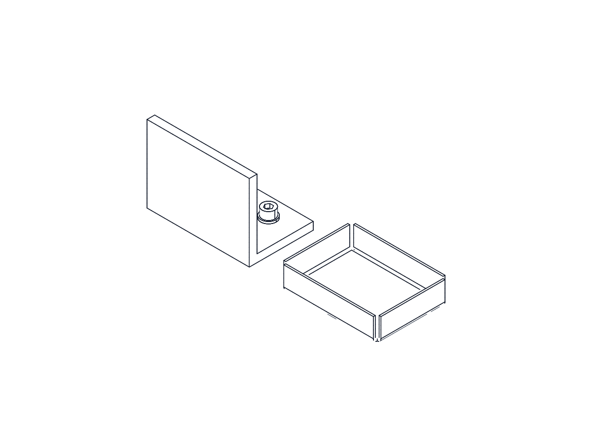
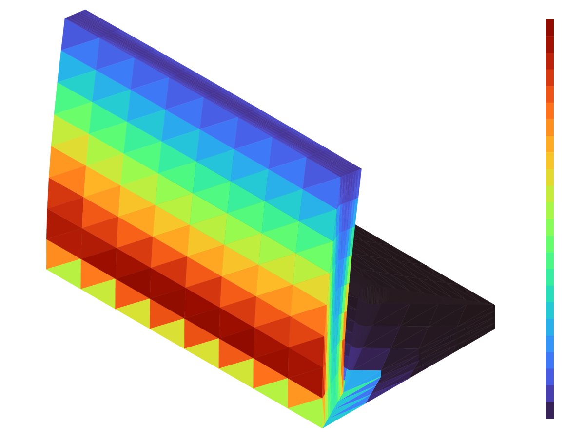

# Contoh lengkap: braket pemasangan + baki sheet metal

Satu berkas, [`mounting_bracket.ops.json`](mounting_bracket.ops.json), yang
memakai semua fitur industri DUCAD dari awal sampai akhir: material dan
properti massa, part standar dan ulir, sheet metal, empat jenis simulasi,
toleransi, konfigurasi varian, dan checks yang menjaga semuanya.



Isi rakitan (6 body):

| Body | Dibuat dengan | Material |
|---|---|---|
| `bracket` | dua `primitive` kotak + `hole` M6 + `boolean` union | Aluminium 6061-T6 |
| `bolt_a`, `bolt_b` | `standard_part` ISO 4762 M6×20 + `thread` | AISI 304 |
| `washer_a`, `washer_b` | `standard_part` ISO 7089 M6 | AISI 304 |
| `tray` | `sketch` + `base_flange` + dua `edge_flange` | Baja S235 |

Semua perintah di bawah dijalankan dari folder ini. Pasang alatnya sekali
dengan `make install-agent-tools` di akar repo.

## 1. Bangun semuanya

```bash
ducad-cli build mounting_bracket.ops.json --out dist/default \
  --formats step,stl,pdf,png,bom,flat
```

Hasil di `dist/default/`: STEP, STL, gambar kerja PDF, PNG, BOM
(`…-bom.csv`, part standar tampil dengan nomor ISO-nya), pola datar baki
(`…-tray-flat.dxf`), hasil tiap studi di `sim/`, dan `report.md`. Build
berhenti dengan kode 3 bila ada check yang gagal.

## 2. Material dan properti massa

```json
{"op":"set_material","id":"bracket_mat","body":"bracket","material":"al_6061_t6"}
```

```bash
ducad-cli run mounting_bracket.ops.json --out mounting_bracket.ducad
ducad-cli inspect mounting_bracket.ducad --mass
```

Braket: 133,68 g, pusat massa [40, 13,4, 18,7] mm, lengkap dengan tensor
inersia dan sumbu utama. Check `bracket_light` menjaga massanya 50–400 g.

## 3. Rakitan: baut, ring, ulir

Lubang dibuat pada pelat dasar *sebelum* di-union dengan dinding, supaya
`">Z"` masih menunjuk permukaan atas pelat:

```json
{"op":"hole","id":"bolt_holes","body":"base","face":">Z",
 "at_world":[[20,"$hole_y","$t"],[60,"$hole_y","$t"]],"spec":{"iso":"M6"}},
{"op":"standard_part","id":"washer_a","standard":"iso7089","size":"M6","at":[20,"$hole_y","$t"]},
{"op":"standard_part","id":"bolt_a","standard":"iso4762","size":"M6","length":20,"at":[20,"$hole_y","$t + 1.6"]},
{"op":"thread","id":"bolt_a_thread","body":"bolt_a","face":"all[kind=cylinder][r=3]","length":14}
```

Posisi memakai `$t`, jadi baut ikut naik saat tebal pelat berubah. Ulirnya
kosmetik (tercatat untuk gambar dan BOM); tambahkan `"cosmetic": false`
untuk memotong alur ulir sungguhan. Check `bolts_clear`
(`no_interference`) memastikan baut dan ring tidak menembus braket.

## 4. Sheet metal

```json
{"op":"base_flange","id":"tray","sketch":"tray_sk","thickness":1.5,"bend_radius":1.5,"k_factor":0.44},
{"op":"edge_flange","id":"tray_wall_x","body":"tray","edges":"|X[len=70][z=0]","length":15},
{"op":"edge_flange","id":"tray_wall_y","body":"tray","edges":"|Y[len=50][z=0]","length":15}
```

Format `flat` pada build menulis pola bentangan sebagai DXF dengan garis
tekuk di layer terpisah. Checks: `min_bend_radius`, `min_flange_length`.

## 5. Simulasi

Braket dijepit di alasnya (`<Z`) pada keempat studi.

| Studi | Jenis | Beban | Hasil | Check |
|---|---|---|---|---|
| `side_load` | `static` | 400 N mendorong puncak dinding ke +Y | 46,9 MPa, 0,23 mm, faktor keamanan 5,9 | `max_stress`, `max_displacement`, `min_safety_factor` |
| `vibration` | `frequency` | — | 1559 / 2860 / 6667 Hz | `min_natural_frequency` |
| `crush` | `buckling` | 2000 N menekan puncak dinding | faktor tekuk 39 (tekuk pada ±78 kN) | `min_buckling_factor` |
| `hot_base` | `thermal` | alas 80 °C, puncak berkonveksi ke udara 25 °C | 79,5–80,0 °C | `max_temperature` |

```bash
ducad-cli sim mounting_bracket.ducad --study side_load --out stress.png
ducad-cli sim mounting_bracket.ducad --study vibration
ducad-cli sim mounting_bracket.ducad --study crush
ducad-cli sim mounting_bracket.ducad --study hot_base
```



Angka simulasi adalah estimasi teknik (sekitar ±10 % pada mesh hex bawaan),
bukan angka sertifikasi.

**Batas penting:** setiap studi menghitung **satu body**. Belum ada studi
rakitan multi-body (kontak atau sambungan baut antar-part); di contoh ini
sambungan baut diwakili oleh tumpuan jepit pada alas braket.

## 6. Toleransi

```json
{"id":"bolt_fit","check":"tolerance_stackup","max_total":0.05,
 "chain":[{"nominal":6,"fit":"H7"},{"nominal":6,"fit":"g6","reverse":true}]}
```

Suaian lubang H7 dengan poros g6 pada Ø6: kelonggaran terburuk 0,024 mm.

## 7. Konfigurasi varian

```json
"configurations": [
  { "name": "thick", "params": { "t": 8 } },
  { "name": "steel", "material_overrides": { "bracket": "s235" } },
  { "name": "bare",  "suppressed_ops": ["tray_wall_x", "tray_wall_y"] }
]
```

```bash
ducad-cli config mounting_bracket.ducad                       # daftar varian
ducad-cli build mounting_bracket.ops.json --out dist/variants --all-configs
```

`dist/variants/report.md` berisi matriks konfigurasi × check; tiap varian
mendapat subfolder sendiri dengan artefak dan hasil simulasinya. Keempat
varian lulus kesebelas check.

## 8. Di aplikasi (GUI)

```bash
cd ../../ducad-editor && cargo run -p ducad-app
```

Buka `mounting_bracket.ducad`, lalu dari command palette (⌘K):

- **Properti Massa** — pilih braket untuk melihat massa, pusat massa, inersia.
- **Simulasi (studi statik)** — studi `side_load`: Jalankan, lalu heatmap
  tampil di model.
- **Fitur Industri**:
  - *Studi* — jalankan `vibration`, `crush`, `hot_base`; hasil berupa angka.
  - *Konfigurasi* — pindah ke `thick`, `steel`, atau `bare`.
  - *Sheet metal* — bentangkan/lipat `tray`, ekspor DXF pola datar.
  - *Toleransi* — susun stack-up dan tambah anotasi GD&T ke lembar gambar.
  - *Part standar* — sisipkan baut lain atau tambah ulir.
  - *Rakitan* — tambah langkah urai untuk baut dan ring, lalu geser faktor
    urai; kopling roda gigi/sekrup juga diatur di sini.

Kopling dan langkah urai hanya ada di GUI (tersimpan di pohon rakitan
`.ducad`), tidak bisa ditulis di berkas ops. Langkah GUI di bagian ini belum
diuji manual; laporkan bila ada yang tidak sesuai.

## Mencoba sendiri

- Ubah `"t": 6` menjadi `4` lalu build ulang: tegangan naik dari 47 ke
  103 MPa, defleksi dari 0,23 ke 0,82 mm, dan faktor tekuk turun dari 39 ke
  6 — semua check masih lulus, tetapi `stiff` (batas 1 mm) sudah tipis.
- Naikkan beban `side_load` sampai `safe` gagal; build keluar dengan kode 3.
- Ganti `"mesh":{"cell_mm":2}` dengan `{"kind":"tet","cell_mm":3}` untuk
  mesh tetra: hasilnya 48,2 MPa, dekat dengan 46,9 MPa dari mesh hex.
